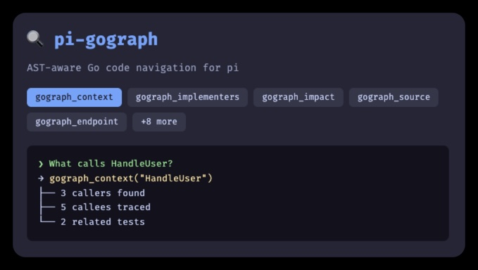

# pi-gograph

[](https://www.npmjs.com/package/pi-gograph)
[](https://opensource.org/licenses/MIT)



[Gograph](https://github.com/ozgurcd/gograph) integration for [pi](https://github.com/earendil-works/pi-mono) — AST-aware Go code navigation as native LLM tools.

## What it does

Gograph builds a compact graph of your Go project's packages, symbols, calls, routes, and tests. This extension exposes gograph's capabilities as native pi tools, so the LLM can navigate your Go codebase with fewer raw file reads and better accuracy.

**Key benefits:**
- `gograph_plan` — pre-edit safety check in ONE call (replaces 5-8 separate tool calls)
- `gograph_review` — post-edit review in ONE call
- `gograph_explain` — architectural narrative in ONE call
- `gograph_context` replaces 4-5 grep/cat calls in one shot
- `gograph_implementers` reliably finds interface implementations
- `gograph_endpoint` traces HTTP handlers from route to SQL

## Prerequisites

- [pi](https://github.com/earendil-works/pi-mono) installed
- [gograph](https://github.com/ozgurcd/gograph) installed (the extension can auto-install it via `/gograph-setup`)

## Installation

```bash
pi install npm:pi-gograph
```

> **Note:** Use `pi install`, not `npm install`. The `pi install` command registers the extension in pi's settings so it auto-activates in Go projects.

Or install manually by copying to your extensions directory:

```bash
git clone https://github.com/yinloo-ola/pi-gograph.git
cp -r pi-gograph ~/.pi/agent/extensions/
```

## Usage

The extension activates automatically in Go projects (detected by `go.mod` or `*.go` files). You'll see a status indicator in pi's footer:

- `📦 gograph: run /gograph-setup` — gograph not installed
- `gograph: run /gograph-build` — installed but no index
- `gograph ✓ (gograph 0.4.0)` — ready (version shown when available)
- `gograph: rebuilding index in background...` — a branch/HEAD change was detected and a refresh is running without blocking other work

### First time setup

If gograph is not installed:

```
/gograph-setup
```

This will:
1. Try to install gograph via Homebrew, falling back to `go install` if brew fails
2. Build the initial index

If gograph is already installed, `/gograph-setup` will offer to upgrade to the latest version.

### Rebuild index

After significant code changes:

```
/gograph-build
```

Or with precise mode (type-checked, slower):

```
/gograph-build --precise
```

### Check status

```
/gograph-status
```

### Automatic background refresh

When you switch git branches or otherwise change the tracked HEAD, pi-gograph will refresh the index in the background the next time you use a gograph tool or `/gograph-status`. Existing operations keep using the last built index until the refresh finishes.

## Tools

### Primary tools (one per task)

| Tool | Purpose |
|------|--------|
| `gograph_build` | Build/rebuild the AST index |
| `gograph_query` | Search for symbols by name |
| `gograph_context` | Full context bundle (source + callers + callees + tests). Supports `--uncommitted` for all modified symbols. |
| `gograph_implementers` | Find structs implementing an interface. Supports `--test-only` for mock/test implementations. |
| `gograph_endpoint` | HTTP handler → SQL vertical slice |
| `gograph_plan` | Pre-edit change plan: callers, tests, blast radius, SQL/env exposure. Supports `--uncommitted` and `--with-context`. |
| `gograph_review` | Post-edit review: test coverage, complexity, broken interfaces. Supports `--uncommitted`. |
| `gograph_explain` | Architectural narrative for any symbol in one call |
| `gograph_summary` | Session-start orientation: type coverage, test quality, dead code, stale files, export surface, dependency health — in one call |
| `gograph_risk` | Pre-commit health check: blast radius, complexity, test coverage, API changes, SQL/env exposure — a single 0-100 verdict |

### Generic tool (`gograph`)

For advanced queries not covered by primary tools. Uses `subcommand` parameter:

| Subcommand | Purpose |
|-----------|--------|
| `callers` | Find callers of a function. Supports `--depth N`. |
| `callees` | Find callees of a function. Supports `--depth N`. |
| `source` | Extract source of one symbol |
| `fields` | All fields of a struct |
| `impact` | Blast radius analysis. Supports `--uncommitted`. |
| `path` | Shortest call chain between two symbols |
| `returnusage` | How callers consume a function's return value |
| `errorflow` | Trace error string from definition to handlers |
| `changes` | Find symbols in changed files. Use `flags: "--git main"`. |
| `check` | Verify uncommitted changes. Supports `--uncommitted`. |
| `focus` | Targeted context for a package |
| `stats` | Index health summary: version, timestamp, counts |
| `dependents` | Find packages that import a given package |
| `usages` | Find all references to a type in signatures and fields |
| `doc` | Surface Go documentation for any stdlib or third-party symbol. No index needed. |
| `literals` | Find all struct literal initialization sites |

## Development

```bash
git clone https://github.com/yinloo-ola/pi-gograph.git
cd pi-gograph
npm install
npm test
```

## License

MIT
